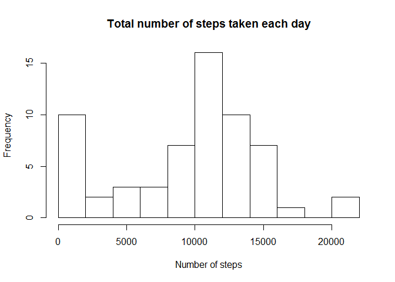
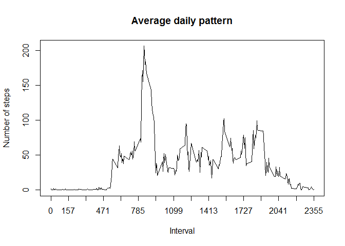
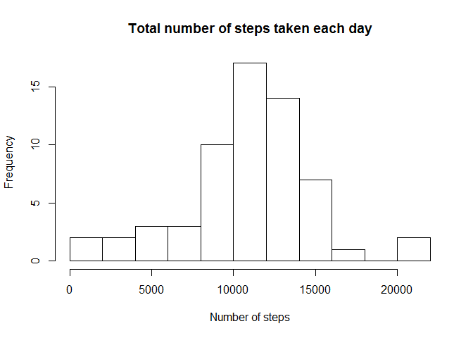
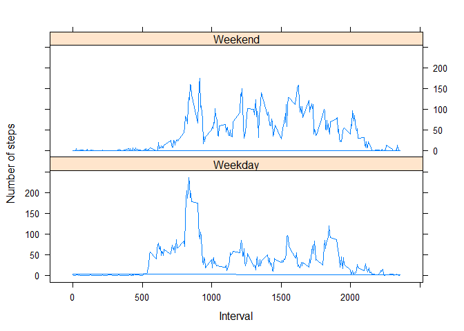

# Reproducible Research: Peer Assessment 1

All the codes presented here assume the following:

1. You are using RStudio

2. You are working in a working directory that prefer to be

3. In that working directory, you already have the "activity.zip" file downloaded from this [link](https://d396qusza40orc.cloudfront.net/repdata%2Fdata%2Factivity.zip)

4. You have already extracted the "activity.csv" files from that zip file into your current working directory

5. You have not altered anything significant from that original "activity.csv" file

Also, you must have the following packages installed for some of the code chunks to work:

- data.table Package (for data processing)

- lattice Package (for plotting)

## Loading and preprocessing the data

For this assignment, we expect to perform data manipulations. So, it would be beneficial for us to use the data.table package.

To read in the data and transform the data into a data.table format, we use the following code:


```r
library(data.table)
data <- read.csv("activity.csv", stringsAsFactors = FALSE)
data <- data.table(data)
```

Then we use **str**, **summary**, and **head** to get some more aditional information on the data.


```r
str(data)
```

```
## Classes 'data.table' and 'data.frame':	17568 obs. of  3 variables:
##  $ steps   : int  NA NA NA NA NA NA NA NA NA NA ...
##  $ date    : chr  "2012-10-01" "2012-10-01" "2012-10-01" "2012-10-01" ...
##  $ interval: int  0 5 10 15 20 25 30 35 40 45 ...
##  - attr(*, ".internal.selfref")=<externalptr>
```

```r
summary(data)
```

```
##      steps            date              interval     
##  Min.   :  0.00   Length:17568       Min.   :   0.0  
##  1st Qu.:  0.00   Class :character   1st Qu.: 588.8  
##  Median :  0.00   Mode  :character   Median :1177.5  
##  Mean   : 37.38                      Mean   :1177.5  
##  3rd Qu.: 12.00                      3rd Qu.:1766.2  
##  Max.   :806.00                      Max.   :2355.0  
##  NA's   :2304
```

```r
head(data)
```

```
##    steps       date interval
## 1:    NA 2012-10-01        0
## 2:    NA 2012-10-01        5
## 3:    NA 2012-10-01       10
## 4:    NA 2012-10-01       15
## 5:    NA 2012-10-01       20
## 6:    NA 2012-10-01       25
```

We need to modify the class of the date column since we are going to manipulate the data by dates later.


```r
data$date <- as.Date(data$date)
str(data)
```

```
## Classes 'data.table' and 'data.frame':	17568 obs. of  3 variables:
##  $ steps   : int  NA NA NA NA NA NA NA NA NA NA ...
##  $ date    : Date, format: "2012-10-01" "2012-10-01" ...
##  $ interval: int  0 5 10 15 20 25 30 35 40 45 ...
##  - attr(*, ".internal.selfref")=<externalptr>
```

With that, everything looks to be okay, so we move on to the next activity.

## What is mean total number of steps taken per day?

For this part, we need the **sum** of the steps per day and the **mean** and **median** of those sums (ignoring missing values).


```r
sum.bydate <- data[, sum(steps, na.rm = TRUE), by = date]
head(sum.bydate)
```

```
##          date    V1
## 1: 2012-10-01     0
## 2: 2012-10-02   126
## 3: 2012-10-03 11352
## 4: 2012-10-04 12116
## 5: 2012-10-05 13294
## 6: 2012-10-06 15420
```

```r
#I used breaks = 10 to have a more detailed look in the histogram
hist(sum.bydate$V1, main = "Total number of steps taken each day", xlab = "Number of steps", breaks = 10)
```

 

```r
mean_sum.bydate <- mean(sum.bydate$V1, na.rm = TRUE)
median_sum.bydate <- median(sum.bydate$V1, na.rm = TRUE)
```

The mean total number of steps per day is 9354.2295082 and the median is 10395.

## What is the average daily activity pattern?


```r
mean.byint <- data[, mean(steps, na.rm = TRUE), by = interval]
head(mean.byint)
```

```
##    interval        V1
## 1:        0 1.7169811
## 2:        5 0.3396226
## 3:       10 0.1320755
## 4:       15 0.1509434
## 5:       20 0.0754717
## 6:       25 2.0943396
```

```r
#I modified xasp to have a more detailed look in the plot
plot(mean.byint$interval, mean.byint$V1, main = "Average daily pattern", xlab = "Interval", ylab = "Number of steps", type = "l", xaxp = c(0, 2355, 15))
```

 

```r
max_introw <- which.max(mean.byint$V1)
max_int <- mean.byint[max_introw, interval]
max_int.steps <- mean.byint[max_introw, V1]
```

The maximum average number of steps per interval is 206.1698113 and it is in interval 835.

## Inputting missing values


```r
num.NA <- sum(is.na(data$steps))
```

The total number of missing values in the dataset is 2304.

If we are manupulating the data per day, using the original data with the missing days would be alright. But if we are manupulating the data per interval, per day of the week, or any other basis for which the missing days are included, then we will possibly encounter biases. To remedy this, we will *change all the NAs to the average number of steps per interval per day of the week*.


```r
data[, day := weekdays(data$date)]
```

```
##        steps       date interval    day
##     1:    NA 2012-10-01        0 Monday
##     2:    NA 2012-10-01        5 Monday
##     3:    NA 2012-10-01       10 Monday
##     4:    NA 2012-10-01       15 Monday
##     5:    NA 2012-10-01       20 Monday
##    ---                                 
## 17564:    NA 2012-11-30     2335 Friday
## 17565:    NA 2012-11-30     2340 Friday
## 17566:    NA 2012-11-30     2345 Friday
## 17567:    NA 2012-11-30     2350 Friday
## 17568:    NA 2012-11-30     2355 Friday
```

```r
data[, mean := mean(steps, na.rm = TRUE), by = list(interval, day)]
```

```
##        steps       date interval    day     mean
##     1:    NA 2012-10-01        0 Monday 1.428571
##     2:    NA 2012-10-01        5 Monday 0.000000
##     3:    NA 2012-10-01       10 Monday 0.000000
##     4:    NA 2012-10-01       15 Monday 0.000000
##     5:    NA 2012-10-01       20 Monday 0.000000
##    ---                                          
## 17564:    NA 2012-11-30     2335 Friday 0.000000
## 17565:    NA 2012-11-30     2340 Friday 0.000000
## 17566:    NA 2012-11-30     2345 Friday 0.000000
## 17567:    NA 2012-11-30     2350 Friday 0.000000
## 17568:    NA 2012-11-30     2355 Friday 1.142857
```

```r
data[, new.steps := ifelse(is.na(data$steps), mean, steps)]
```

```
##        steps       date interval    day     mean new.steps
##     1:    NA 2012-10-01        0 Monday 1.428571  1.428571
##     2:    NA 2012-10-01        5 Monday 0.000000  0.000000
##     3:    NA 2012-10-01       10 Monday 0.000000  0.000000
##     4:    NA 2012-10-01       15 Monday 0.000000  0.000000
##     5:    NA 2012-10-01       20 Monday 0.000000  0.000000
##    ---                                                    
## 17564:    NA 2012-11-30     2335 Friday 0.000000  0.000000
## 17565:    NA 2012-11-30     2340 Friday 0.000000  0.000000
## 17566:    NA 2012-11-30     2345 Friday 0.000000  0.000000
## 17567:    NA 2012-11-30     2350 Friday 0.000000  0.000000
## 17568:    NA 2012-11-30     2355 Friday 1.142857  1.142857
```

```r
##To create a new dataset that is equal to the original dataset but with the missing data filled in
data2 <- copy(data[, list(steps = new.steps, date, interval)])
```


```r
sum.bydate2 <- data2[, sum(steps), by = date]
head(sum.bydate2)
```

```
##          date        V1
## 1: 2012-10-01  9974.857
## 2: 2012-10-02   126.000
## 3: 2012-10-03 11352.000
## 4: 2012-10-04 12116.000
## 5: 2012-10-05 13294.000
## 6: 2012-10-06 15420.000
```

```r
#I used breaks = 10 to have a more detailed look in the histogram
hist(sum.bydate2$V1, main = "Total number of steps taken each day", xlab = "Number of steps", breaks = 10)
```

 

```r
mean_sum.bydate2 <- mean(sum.bydate2$V1)
median_sum.bydate2 <- median(sum.bydate2$V1)
```

The mean total number of steps per day is 1.082121\times 10^{4} and the median is 1.1015\times 10^{4}.

The histogram, mean value, and mediam value from this new dataset with the missing values filled in are all different from the old dataset with missing values. The inputting of missing data makes estimates of the total daily number of steps possibly "nearer" to the true estimate unlike the estimates from the dataset with missing values which give underestimates due to missing days.

## Are there differences in activity patterns between weekdays and weekends?


```r
data2[, day := weekdays(data2$date)]
```

```
##           steps       date interval    day
##     1: 1.428571 2012-10-01        0 Monday
##     2: 0.000000 2012-10-01        5 Monday
##     3: 0.000000 2012-10-01       10 Monday
##     4: 0.000000 2012-10-01       15 Monday
##     5: 0.000000 2012-10-01       20 Monday
##    ---                                    
## 17564: 0.000000 2012-11-30     2335 Friday
## 17565: 0.000000 2012-11-30     2340 Friday
## 17566: 0.000000 2012-11-30     2345 Friday
## 17567: 0.000000 2012-11-30     2350 Friday
## 17568: 1.142857 2012-11-30     2355 Friday
```

```r
data2[, weekday := ifelse(day == "Saturday" | day == "Sunday", "Weekend", "Weekday")]
```

```
##           steps       date interval    day weekday
##     1: 1.428571 2012-10-01        0 Monday Weekday
##     2: 0.000000 2012-10-01        5 Monday Weekday
##     3: 0.000000 2012-10-01       10 Monday Weekday
##     4: 0.000000 2012-10-01       15 Monday Weekday
##     5: 0.000000 2012-10-01       20 Monday Weekday
##    ---                                            
## 17564: 0.000000 2012-11-30     2335 Friday Weekday
## 17565: 0.000000 2012-11-30     2340 Friday Weekday
## 17566: 0.000000 2012-11-30     2345 Friday Weekday
## 17567: 0.000000 2012-11-30     2350 Friday Weekday
## 17568: 1.142857 2012-11-30     2355 Friday Weekday
```

```r
data2[, mean := mean(steps), by = list(interval, weekday)]
```

```
##           steps       date interval    day weekday       mean
##     1: 1.428571 2012-10-01        0 Monday Weekday 2.31071429
##     2: 0.000000 2012-10-01        5 Monday Weekday 0.45000000
##     3: 0.000000 2012-10-01       10 Monday Weekday 0.17500000
##     4: 0.000000 2012-10-01       15 Monday Weekday 0.20000000
##     5: 0.000000 2012-10-01       20 Monday Weekday 0.08888889
##    ---                                                       
## 17564: 0.000000 2012-11-30     2335 Friday Weekday 1.69722222
## 17565: 0.000000 2012-11-30     2340 Friday Weekday 1.84722222
## 17566: 0.000000 2012-11-30     2345 Friday Weekday 0.20000000
## 17567: 0.000000 2012-11-30     2350 Friday Weekday 0.30000000
## 17568: 1.142857 2012-11-30     2355 Friday Weekday 1.39801587
```

```r
library(lattice)
xyplot(mean ~ interval | weekday, data = data2, layout = c(1, 2), xlab = "Interval", ylab = "Number of steps", type = "l")
```

 
